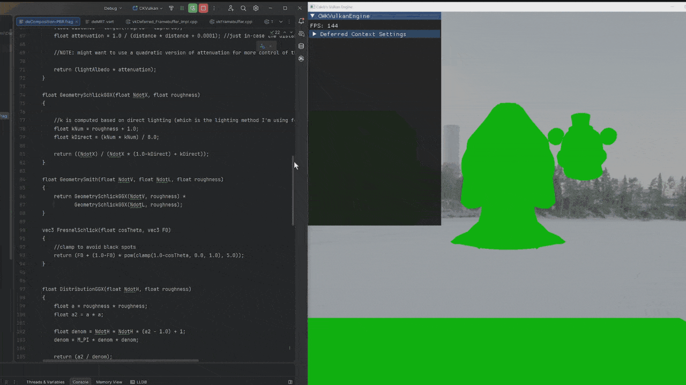
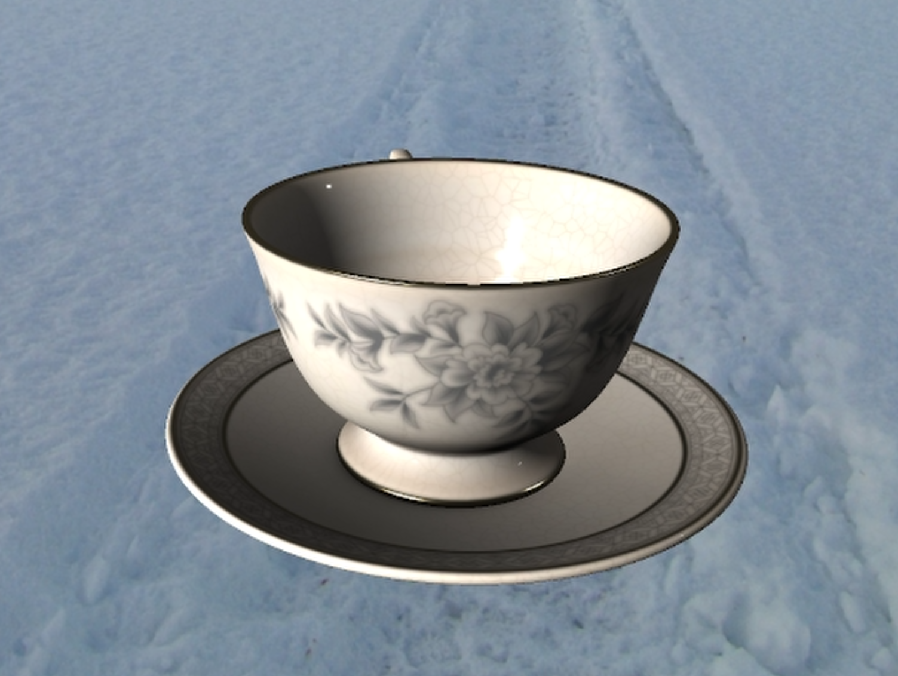

# Caleb's Custom Vulkan Graphics Engine

Hi, welcome to my Github page! As of September 25th, 2025, I've made this repository public for all to see my progress! There'll be lots of updates in the coming weeks, months, maybe even years!

  
  
<em>A shadow mapping implementation written under my codebase</em>

# Overview

This engine fundamentally uses a <b>layered</b> architecture. There is an application layer,
rendering layer, resource management layer, and scene layer to create clear separation of responsibility and modularity
within the engine. 

This architecture was chosen to support the small-scale, educational intent of this project.

In the near future, I will move over to ECS which offers greater performance potential and modularity.

### Goals for this project

* Learn Vulkan and GPU architecture
* Implement algorithms and build scalable systems for graphics development
* Strengthen my tooling mindset
* Have fun and make some cool freakin demos to share

My dream has always been to become an elite toy maker whose creations delight users around the world.

# Highlighted Features

## Hot Reloading

## Async Asset Loading

## Physically-Based Rendering w/ Textures

<em><b>Supported Materials</b>: BaseColor, MetallicRoughness, AmbientOcclusion, Occlusion-Roughness-Metallic (ORMT) </em>

# Build Instructions
**General Requirements:**

<ul>
     <li>C++20 compatible compiler/linker/debugger
        <ul>
            <li>Bundled with Microsoft Visual Studio (Desktop C++ Component)</li>
            <li>gcc, clang/LLVM specifically for other platforms</li>
        </ul>
    </li>
    <li><a href="https://vulkan.lunarg.com/sdk/home">Vulkan SDK (1.4+)</a></li>
    <li>
        <a href="https://cmake.org/download/">CMake versions 3.2-3.5</a>
        <ul>
            <li>Bundled with Visual Studio (C++ CMake Tools for Windows Component)</li>
        </ul>
    </li>
    <li>Ninja build generator (required to run .bat/.sh scripts)
        <ul>
            <li>Bundled with Visual Studio CMake tools</li>
            <li>Can use another build generator as well but you'll have to build manually</li>
        </ul>
    </li>
    <li><a href="https://www.python.org/downloads/">Python 3.13+</a> (required in order to compile shaderc)</li>
   
    
</ul>

Ensure to have the correct drivers installed for Vulkan 1.4 and above according to your hardware vendor:

<ul>
  <li><a href="https://www.amd.com/en/support/download/drivers.html">AMD</a></li>
  <li><a href="https://www.nvidia.com/en-us/drivers/">Nvidia</a></li>
  <li><a href="https://www.intel.com/content/www/us/en/download-center/home.html">Intel</a></li>
  <li>other...</li>
</ul> 

An IDE is <em>highly</em> recommended for development:
<ul>
    <li><a href="https://visualstudio.microsoft.com/downloads/">Visual Studio (for Windows)</a></li>
    <li><a href="https://www.jetbrains.com/clion/">CLion (cross-platform)</a></li>
    <li>...</li>
    
</ul>

**Windows:**

  <ol>
    <li><a href="https://visualstudio.microsoft.com/downloads/">
    Download and install the latest version of Visual Studio</a>
        <ol>
            <li>Check <b><em>Desktop development with C++</em></b> under the workloads tab in the installer</li>
            <li>Ensure you have MSVC build tools v143 or higher (Check <b><em>Optional</em></b> dropdown)</li>
        </ol>
    </li>
    <li>Clone the repo</li>
    <li>Run the <b><em>batch (.bat)</em></b> script</li>
    <li>Go to <b><em>build</em></b> folder</li>
    <li>Open .sln, run the project, mess with it, etc.</li>
    <li>Start Coding</li>
  </ol> 

**Linux:** 

<em><b>NOTE:</b> This was tested on WSL, Ubuntu 25.04 (Plucky Puffin), and Ubuntu 24.04 (Noble Numbat).</em>

<ol>
  <li>Clone the repo</li>
  <li>Run the <em>bash (.sh)</em> script</li>
  <li>Go to build folder, run the produced executable ("CKVulkan"), mess with it, etc.</li>
  <li>Start Coding</li>
</ol> 

# 
